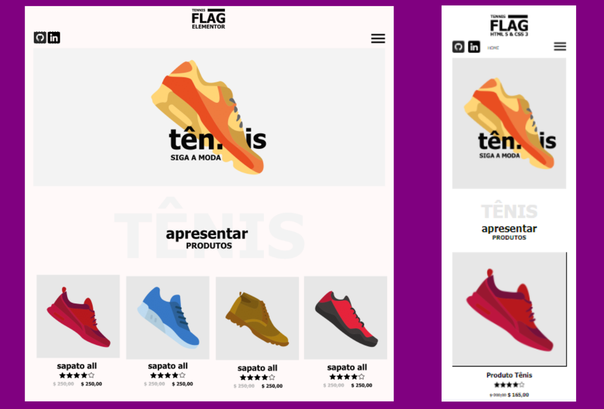

# **Site de Tenis Flag**

## Sobre o projeto

Projeto: [trabalho de front-end](https://front-end-site-tenis-flag.vercel.app/)

Trabalho de front-end, com uso de flexbox, atendendo aos requisitos de estrutura e visual aplicado. 

Front-end work, using flexbox, meeting the structure and visual requirements applied.

## Layout mobile e web

## Tecnologias Utilizadas

* HTML 5
* CSS 3
* Flexbox

## Autor

#### **Katarine Albuquerque**

    
    &nbsp;
    

